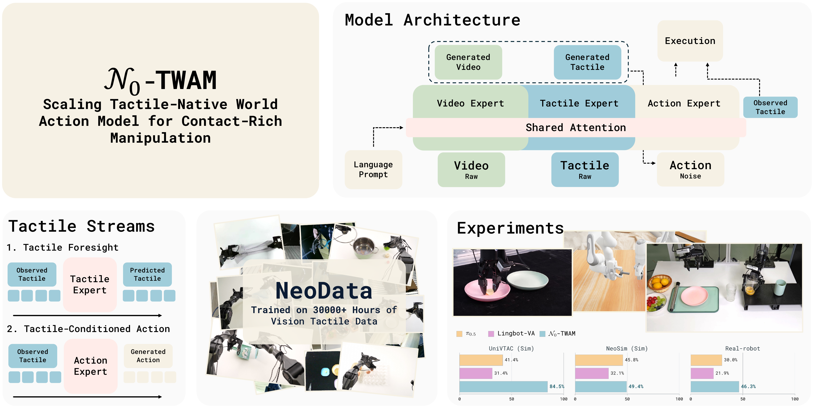
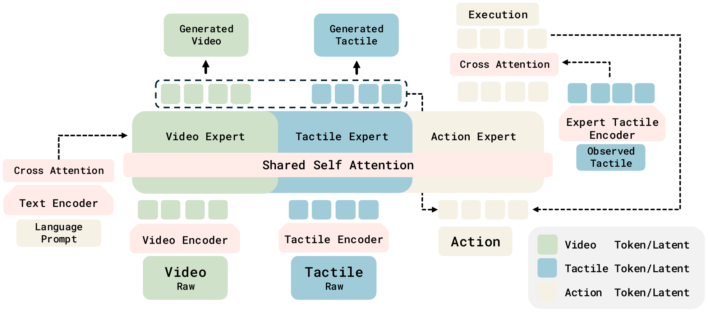

<h1 align="center">N<sub>0</sub>-TWAM: A Tactile-Native World Action Model</h1>

<p align="center">
  <a href="https://research.neoteai.com/n0-twam/"></a>
  <a href="https://research.neoteai.com/assets/n0-twam-paper.pdf"></a>
  <a href="LICENSE"></a>
</p>

<h2 align="center">🔥 N<sub>0</sub>-TWAM Has Been Released! 🔥</h2>

<p align="center"><strong>The pretrained checkpoint, inference server, and post-training toolkit are now available.</strong></p>

$N_0$-TWAM is a Vision–Tactile–Action world-action model. Vision, tactile, and
action are jointly modeled by a Mixture-of-Transformers (MoT) under a single
rectified-flow / flow-matching objective, so the model both predicts the visual and
tactile future and generates the low-level action that realizes it.

This repository releases the model, the inference server, and the post-training
toolkit, so you can load our pretrained weights and adapt $N_0$-TWAM to your own
robot and tasks. It does not ship the large-scale pretraining pipeline.

<p align="center">
  
</p>

<p align="center">
  <a href="https://research.neoteai.com/n0-twam/">
    
  </a>
  <br><em>Real-robot demo highlights — click for the full video on the
  <a href="https://research.neoteai.com/n0-twam/">project page</a>.</em>
</p>

## Capabilities

- Load the pretrained $N_0$-TWAM checkpoint (`n0_twam.models.utils.load_mot_checkpoint`).
- Post-train it on your own demonstrations (`n0_twam/train.py`) — see [POST_TRAINING.md](docs/POST_TRAINING.md).
- Serve it over a websocket and get actions from observations (`n0_twam/n0_twam_server.py`) — see [DEPLOY.md](docs/DEPLOY.md).
- Evaluate it closed-loop in the [NeoSim](https://github.com/neoteai/NeoSim) vision–tactile benchmark — see [Evaluate in NeoSim](#evaluate-in-neosim-closed-loop).
- Drive it closed-loop from your own robot or simulator (`example_client/closed_loop_client.py`, numpy-only) — see [DEPLOY.md](docs/DEPLOY.md#5-close-the-loop).

## Model summary

| Component | Choice |
|---|---|
| Backbone | WAN2.2 TI2V-5B video diffusion transformer, restructured into a 3-expert MoT |
| Video VAE | Wan2.2 `AutoencoderKLWan` (`z_dim=48`, 4× temporal / 16× spatial); 256×256×129 → 48×33×16×16 latent |
| Text encoder | umT5-xxl (4096-d), frozen |
| Objective | Rectified-flow / flow-matching (`FlowMatchScheduler`), per-frame timesteps |
| Resolution / SNR shift | video & tactile `snr_shift=5.0`, action `snr_shift=1.0` |
| Precision | bf16 parameters, fp32 reductions (FSDP2 `MixedPrecisionPolicy`) |
| Action space | 20-dim dual-arm end-effector, π0.5-style horizon delta |

See the Highlights section at the bottom for the modeling ideas.

<p align="center">
  
  <br><em>Model overview: a Mixture-of-Transformers over joint video / tactile / action tokens.</em>
</p>

## Repository structure

```
n0-twam/
├── n0_twam/                        # the model package
│   ├── models/                     # MoT backbone
│   │   ├── mot.py                  #   Mixture-of-Transformers (per-modality experts + shared attn)
│   │   ├── model.py                #   transformer blocks, tactile & action heads
│   │   └── utils.py                #   load_mot_checkpoint, VAE / text-encoder loaders
│   ├── configs/                    # config registry (TWAM_CONFIGS)
│   │   ├── shared_config.py        #   shared defaults
│   │   ├── twam_base_cfg.py        #   released-checkpoint model config (20-d action, tactile)
│   │   ├── twam_posttrain_cfg.py   #   post-training recipe (edit this — POST_TRAINING.md)
│   │   ├── twam_posttrain_server_cfg.py  # paired serve config (inherits the recipe)
│   │   └── twam_server_cfg.py      #   inference-server config (released pretrain ckpt)
│   ├── dataset/                    # LeRobot latent datasets + bucket sampler
│   ├── distributed/                # FSDP2 sharding helpers
│   ├── utils/                      # flow-matching scheduler, logging, websocket serving
│   │   └── Simple_Remote_Infer/    #   websocket policy server + client
│   ├── train.py                    # training / post-training entry point
│   ├── n0_twam_server.py           # inference server (obs → action)
│   └── render_mot.py               # roll-out / visualization
├── script/                         # data preparation for post-training
│   ├── encode_lerobot_n0_latents.py    # RGB frames → Wan2.2 VAE latents
│   ├── encode_tactile_latent.py        # tactile videos → global/local latents
│   ├── build_task_pool.py              # task pool + norm stats (absEE / delta)
│   ├── make_serve_bundle.py            # checkpoint + base model → serve bundle
│   └── build_segment_index.py          # segment index (CSV) over multi-repo buckets
├── run_posttrain.sh                # post-training launcher
├── diagrams/ · example_client/     # figures, example observations,
│                                   #   simple_client.py (open-loop smoke),
│                                   #   closed_loop_client.py (drive your robot)
├── docs/                           # INSTALL.md · POST_TRAINING.md · DEPLOY.md
├── requirements.txt · pyproject.toml · LICENSE
```

## Installation

See [INSTALL.md](docs/INSTALL.md). In short:

```bash
pip install .
pip install flash-attn --no-build-isolation
```

## 📦 Model Download

| Model | Contents | Link |
|---|---|---|
| $N_0$-TWAM pretrained | `transformer/` `vae/` `text_encoder/` `tokenizer/` + `norm_stat_pretrain.json` + `empty_emb.pt` | [NeoteAI/n0-twam-base](https://huggingface.co/NeoteAI/n0-twam-base) |

```python
from huggingface_hub import snapshot_download
bundle = snapshot_download("NeoteAI/n0-twam-base")
```

## Quick start — load the pretrained model

```python
import torch
from n0_twam.models.utils import load_mot_checkpoint

# `transformer/` holds the released checkpoint (config.json + weights).
model = load_mot_checkpoint(f"{bundle}/transformer",
                            torch_dtype=torch.bfloat16, torch_device="cuda")
print(f"{sum(p.numel() for p in model.parameters()) / 1e9:.2f} B params")  # -> 7.16
```

To adapt it to your own data, follow [POST_TRAINING.md](docs/POST_TRAINING.md); to serve it,
follow [DEPLOY.md](docs/DEPLOY.md).

## Evaluate in NeoSim (closed-loop)

[NeoSim](https://github.com/neoteai/NeoSim) is our vision–tactile simulation
benchmark. Its `eval/` clients speak this server's streaming protocol natively:
the client runs the simulator, queries the server chunk by chunk, and re-grounds
the model's KV cache on the actually executed observations.

**1. Set up NeoSim** — follow the
[NeoSim installation guide](https://github.com/neoteai/NeoSim#installation).
Keep it in its own environment: the simulator and the model server have
incompatible dependency stacks, which is what the websocket split is for.

**2. Launch the inference server** (bundle + config: [DEPLOY.md](docs/DEPLOY.md)):

```bash
python -m n0_twam.n0_twam_server --config-name posttrain_server --port 29601
```

**3. Run the evaluation client** in the NeoSim repo (held-out protocol =
20 episodes, seeds 100–119):

```bash
python eval/eval_twam_ee_cl.py <task> demo --server_host <server-ip> --server_port 29601 \
    --prompt "<training prompt, verbatim>" --start_seed 100 --total_num 20
```

Key matching and tactile-representation alignment are covered in
[DEPLOY.md — Serving for NeoSim evaluation](docs/DEPLOY.md#serving-for-neosim-evaluation).

**Not using NeoSim?** [`example_client/closed_loop_client.py`](example_client/closed_loop_client.py)
speaks the same streaming protocol — reset, chunked inference, and KV-cache
re-grounding — without a simulator, so you can drive the policy from your own
robot. It needs only numpy, websockets and msgpack. See
[DEPLOY.md — Close the loop](docs/DEPLOY.md#5-close-the-loop).

## Highlights

- *Three modality experts (MoT).* Separate video, tactile, and action experts are
  coupled through shared cross-attention, each with its own width/FFN.
- *One flow-matching objective for all modalities*, with the three streams weighted
  equally (1 : 1 : 1) and a shared per-frame noise schedule, so video, tactile, and the
  action tokens of a frame stay temporally aligned and can be co-generated.
- *Tactile as both a target and a condition.* A global tactile stream is co-generated
  as a diffusion target (predicted as a residual over the first frame), while an
  optional local tactile pathway feeds the action expert the current observed tactile
  frame through cross-attention. During multi-task pretraining the tactile
  condition is randomly dropped (p=0.1) for robustness to missing sensors;
  single-task post-training keeps tactile always present.

## Citation

```bibtex
@misc{n0twam2026,
      title={$N_0$-TWAM: Scaling Tactile-Native World-Action Model for Contact-Rich Manipulation}, 
      author={NeoteAI Team and Fudan TEAI Team},
      year={2026},
      eprint={2607.23783},
      archivePrefix={arXiv},
      url={https://arxiv.org/abs/2607.23783}, 
}
```

## Acknowledgments

This work builds upon several excellent open-source projects:

- [LingBot-VA](https://github.com/robbyant/lingbot-va) — the causal world-modeling framework this work builds on
- [Wan2.2](https://github.com/Wan-Video/Wan2.2) — video diffusion transformer backbone (TI2V-5B) and the 48-channel VAE
- [FastWAM](https://github.com/yuantianyuan01/FastWAM) — the Mixture-of-Transformers (shared-attention video + action experts) design our MoT references
- [LeRobot](https://github.com/huggingface/lerobot) — dataset format and tooling

## License

Released under the CC-BY-NC-SA-4.0 license. See [LICENSE](LICENSE).
Redistributed third-party components keep their own licenses (the Wan2.2
VAE / text encoder / tokenizer and the openpi-derived websocket client are
Apache-2.0 — their notices are retained).
